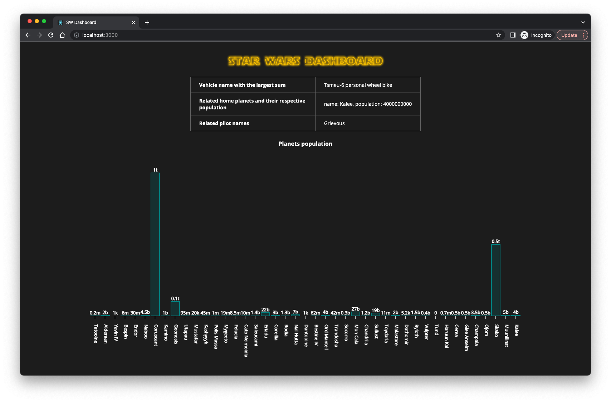

# Star Wars dashboard
A simple dashboard that fetches data from [SWAPI](https://swapi.py4e.com/) and displays a bar chart for planets data rendered by svg elements, and a table with the vehicle that has the highest sum of population for all its pilots’ home planets. 

## Running the project
1. Clone the repo.
1. Run `npm install`.
1. Run `npm start`.
1. Navigate to `http://localhost:3000`.
